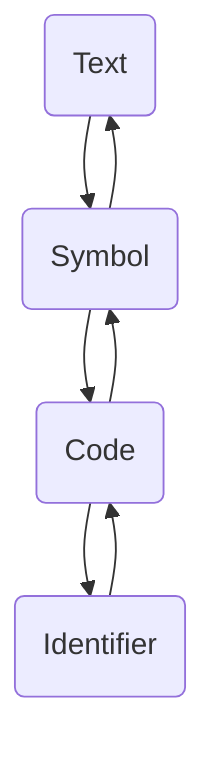
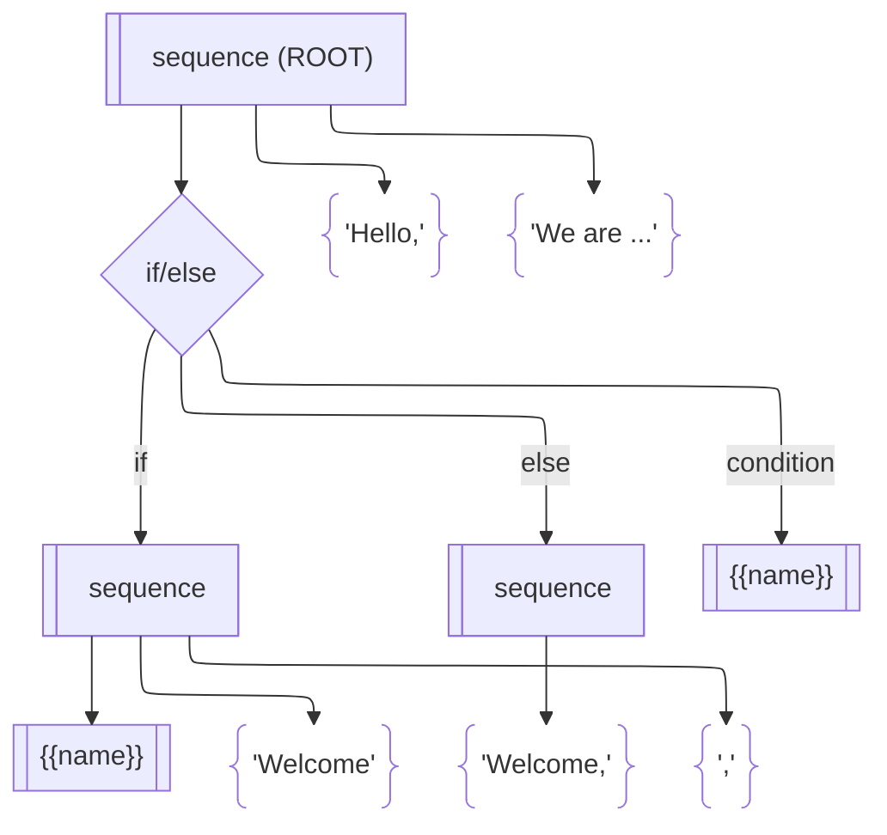

# `lexparse`

[](https://godoc.org/github.com/ianlewis/lexparse)
[](https://goreportcard.com/report/github.com/ianlewis/lexparse)
[](https://github.com/ianlewis/lexparse/actions/workflows/pull_request.tests.yml)
[](https://codecov.io/gh/ianlewis/lexparse)
[](https://conventionalcommits.org)
[](https://securityscorecards.dev/viewer/?uri=github.com%2Fianlewis%2Flexparse)

Experimental lexer/parser library written in Go. Currently under active
development.

---

`lexparse` is a library for creating hand-written lexers and parsers. The API is
based loosely off of Rob Pike's [Lexical Scanning in
Go](https://www.youtube.com/watch?v=HxaD_trXwRE) where the lexer's state is
itself a function. `lexparse` extends this concept to the parser and implements
state via an interface to allow data to be held for each state without the need
for a closure.

## Why write a hand-written parser?

Hand-written parsers can be easier to write and manage in some situations. They
are often faster and can provide more helpful error messages if written well.
Rob Pike's [Lexical Scanning in
Go](https://youtu.be/HxaD_trXwRE?si=_yteHtmcZBVXUv0E&t=552) outlines some of
these arguments in the beginning of the talk.

## Installation

You can install the library into your project using `go get`.

```shell
go get github.com/ianlewis/lexparse
```

## Lexing API

The API for `lexparse` is broken up into a lexing API and an optional parsing
API. The lexing API handles separating input into tokens.

### `Lexer`

The `Lexer` interface represents a [lexical
analyzer](https://en.wikipedia.org/wiki/Lexical_analysis) and operates on a
buffered stream of text and outputs tokens which consist of a value (the text)
and a type. It defines a `NextToken` method for retrieving the next token from
the input stream, and an `Err` method for retrieving errors.

```go
// Lexer is an interface that defines the methods for a lexer that tokenizes
// input streams. It reads from an input stream and emits [Token]s.
type Lexer interface {
    // NextToken returns the next token from the input. If there are no more
    // tokens, the context is canceled, or an error occurs, it returns a Token
    // with Type set to [TokenTypeEOF].
    NextToken(context.Context) *Token

    // Err returns the error encountered by the lexer, if any. If the error
    // encountered is [io.EOF], it will return nil.
    Err() error
}
```

## `ScanningLexer`

The `ScanningLexer` implements the `Lexer` interface using Go's built-in
[`text/scanner`](https://pkg.go.dev/text/scanner) package. It is able to
tokenize a wide variety of input that is similar enough to Go source code. For
example, it is used in [`infix_example_test.go`](./infix_example_test.go) to
tokenize simple mathematical expressions.

```go
r := strings.NewReader("1 + 3 * (4 - 2)")
l := lexer.NewScanningLexer(r)

t := &lexer.Token{}
ctx := context.Background()
for t.Type != lexer.TokenTypeEOF {
    t = l.NextToken(ctx)
    fmt.Printf("%s\n", t)
}
if err := l.Err(); err != nil {
    panic(err)
}

// Output:
1:1:1:2: 1
1:3:1:4: +
1:5:1:6: 3
1:7:1:8: *
1:9:1:10: (
1:10:1:11: 4
1:12:1:13: -
1:14:1:15: 2
1:15:1:16: )
1:16:1:16: <EOF>
```

## `CustomLexer`

The `CustomLexer` implements the `Lexer` interface and provides a framework for
building a lexer with custom logic. It is a [finite state
machine](https://en.wikipedia.org/wiki/Finite-state_machine) where each state
(`LexState`) includes some logic for processing input while in that state. The
`CustomLexer` maintains a cursor to the start of the currently processed token
in addition to the underlying reader's position. When the token has been fully
processed it can be emitted to a channel for further processing by the `Parser`.

Developers implement the token processing portion of the lexer by implementing
`LexState` interface for each relevant lexer state. `CustomLexer` is passed to
each `LexState` during processing and includes a number of methods that can be
used to advance through the input text.

For example, consider the following simple template language.

```jinja
Hello,

Welcome {{ name }},

Welcome,


We are looking forward to your visit.
```

The `CustomLexer` might produce something like the following tokens:

| Type           | Value                                           | State      |
| -------------- | ----------------------------------------------- | ---------- |
| Text           | `"Hello,\n"`                                    | Text       |
| Block Start    | ``                                            | Symbol     |
| Text           | `"\nWelcome "`                                  | Text       |
| Variable Start | `{{`                                            | Symbol     |
| Identifier     | `name`                                          | Identifier |
| Variable End   | `}}`                                            | Symbol     |
| Text           | `",\n"`                                         | Text       |
| Block Start    | ``                                            | Symbol     |
| Text           | `"\nWelcome,\n"`                                | Text       |
| Block Start    | ``                                            | Symbol     |
| Text           | `"\n\nWe are looking forward to your visit.\n"` | Text       |

For a template language, parsing text is a sort of default state so the state
machine might look like the following.

- `Text`: processes and emits text tokens.
- `Symbol`: processes symbol delimiters like `{{`, ``, `}}`.
- `Code`: processes a number of identifiers between symbols. Discards
  whitespace.
- `Identifier`: processes a single identifier.



The `CustomLexer` shouldn't necessarily be concerned with which symbols or
identifiers are showing up in which order at this point. Robust error checking
can be performed later by the parser.

## `LexState`

Each state is represented by an object implementing the `LexState` interface. It
contains only a single `Run` method which handles processing input text while in
that state.

```go
// LexState is the state of the current lexing state machine. It defines the
// logic to process the current state and returns the next state.
type LexState interface {
    // Run returns the next state to transition to or an error. If the returned
    // next state is nil or the returned error is io.EOF then the Lexer
    // finishes processing normally.
    Run(context.Context, *Lexer) (LexState, error)
}
```

We will first need to define our token types.

```go
const (
    textType lexer.TokenType = iota
    blockStartType
    blockEndType
    varStartType
    varEndType
    identifierType
)
```

If we don't need to carry any data with our state we can implement it with a
function that has the same signature as `LexState.Run`. The function can be
converted to a `LexState` by the `LexStateFn` function.

For example, in the `lexText` function we peek at the input to determine if we
need to emit the current token and change state. Otherwise, we continue
advancing over the text.

```go
// lexText tokenizes normal text.
func lexText(_ context.Context, l *lexer.CustomLexer) (lexer.LexState, error) {
    for {
        p := l.PeekN(2)
        switch string(p) {
        case tokenBlockStart, tokenVarStart:
            if l.Width() > 0 {
                l.Emit(lexTypeText)
            }
            return lexer.LexStateFn(lexCode), nil
        default:
        }

        // Advance the input.
        if !l.Advance() {
            // End of input. Emit the text up to this point.
            if l.Width() > 0 {
                l.Emit(lexTypeText)
            }
            return nil, nil
        }
    }
}
```

Each state can be implemented this way to complete the `CustomLexer` logic. You
can find a full working example in
[`template_example_test.go`](./template_example_test.go).

### Invoking the `CustomLexer`

The `CustomLexer` is initialized with a starting state, a channel to send tokens
to, and a reader for the input.

```go
r := strings.NewReader(textString)
l := lexer.NewCustomLexer(r, initState)

t := &lexer.Token{}
ctx := context.Background()
for t.Type != lexer.TokenTypeEOF {
    t = l.NextToken(ctx)
    fmt.Printf("%s\n", t)
}
if err := l.Err(); err != nil {
    panic(err)
}
```

## Parsing API

The parsing API takes tokens from a `Lexer`, processes them, and creates an
[abstract syntax tree](https://en.wikipedia.org/wiki/Abstract_syntax_tree)
(AST). The parsing API is optional in that the `Lexer` can be used on its own,
or with a parser that is better suited to your use case.

### Parser

Like the `Lexer` in the lexing API, the parsing API's `Parser` is a finite state
machine with each state (`ParseState`) implementing some logic for that state.
The `Parser` maintains the AST as it's being created and a pointer to the
current node in the tree. This allows each `ParseState` to operate on the tree
in the correct position. However, there are two major differences from the
lexing API.

One difference from the lexer API is that the parser API utilizes [Go's
generics](https://go.dev/doc/tutorial/generics). Nodes in the AST use generics
to allow each node to hold custom data.

The second is that the `Parser` manages state on a
[stack](<https://en.wikipedia.org/wiki/Stack_(abstract_data_type)>). This allows
for more recursive style of parsing by pushing future expected states onto the
stack while also accommodating adding new expected states at each level.

Using the example template language above, the `Parser` might generate an AST
that looks like the following.



### `ParseState`

Similar to the lexer API, each parser state is represented by an object
implementing the `ParseState` interface. It contains only a single `Run` method
which handles processing input tokens while in that state.

```go
// ParseState is the state of the current parsing state machine. It defines the
// logic to process the current state and returns the next state.
type ParseState[V comparable] interface {
    // Run returns the next state to transition to or an error. If the returned
    // next state is nil or the returned error is io.EOF then the Lexer
    // finishes processing normally.
    Run(context.Context, *Parser[V]) (ParseState[V], error)
}
```

We will first define our node types and custom data.

```go
type nodeType int

const (
    // nodeTypeSeq is a node whose children are various text,if,var nodes in
    // order.
    nodeTypeSeq nodeType = iota

    // nodeTypeText is a leaf node comprised of text.
    nodeTypeText

    // nodeTypeBranch is a binary node whose first child is the 'if' sequence
    // node and second is the 'else' sequence node.
    nodeTypeBranch

    // nodeTypeVar nodes are variable leaf nodes.
    nodeTypeVar
)

type tmplNode struct {
    typ     nodeType

    // Fields below are populated based on node type.
    varName string
    text    string
}
```

The parser's base state `parseSeq` handles a sequence of text or logic nodes.
Here we push the later relevant expected state onto the parser's stack.

```go
// parseSeq delegates to another parse function based on token type.
func parseSeq(_ context.Context, p *lexparse.Parser[*tmplNode]) error {
    token := p.Peek()

    switch token.Type {
    case lexTypeText:
        p.PushState(lexparse.ParseStateFn(parseText))
    case lexTypeVarStart:
        p.PushState(lexparse.ParseStateFn(parseVarStart))
    case lexTypeBlockStart:
        p.PushState(lexparse.ParseStateFn(parseBlockStart))
    }

    return nil
}
```

Multiple expected states can be pushed onto the stack at once. Here we can
expect a variable name identifier and variable close symbol (`}}`). The states
are pushed in reverse order so that they are handled in the order listed.

```go
// parseVarStart handles var start (e.g. '{{').
func parseVarStart(_ context.Context, p *lexparse.Parser[*tmplNode]) error {
    // Consume the var start token.
    _ = p.Next()

    p.PushState(
        lexparse.ParseStateFn(parseVar),
        lexparse.ParseStateFn(parseVarEnd),
    )

    return nil
}
```

Each state can be implemented this way to complete the logic of the `Parser`.
You can find a full working example in
[`template_example_test.go`](./template_example_test.go).

### Invoking the `Parser`

The `Parser` is initialized with a channel to receive tokens from, and the
initial parser state.

```go
tokens := make(chan *lexer.Token, 1024)
parser := lexparse.NewParser(tokens, initState),

go func() {
    // send some tokens to the channel.
    tokens<-lexer.Token{
        Type: tokenTypeText,
        Value: "some",
    }

    tokens<-lexer.Token{
        Type: tokenTypeText,
        Value: "token",
    }

    // Close the tokens channel to indicate there are no more tokens.
    close(tokens)
}()

if err := parser.Parse(context.Background); err != nil {
    panic(err)
}
```

## Invoking the lexer and parser together

A `Lexer` and `Parser` can be used together by calling the `LexParse` function.
This returns the root node of the abstract syntax tree.

```go
tmpl := `Hello, {{ subject }}World!`
r := runeio.NewReader(strings.NewReader(tmpl))

tree, err := lexparse.LexParse(
    context.Background(),
    lexer.NewCustomLexer(r, lexparse.LexStateFn(lexText)),
    lexparse.ParseStateFn(parseRoot), // Starting parser state
)
```

## Similar projects

- [`zalgonoise/lex`]/[`zalgonoise/parse`]: A good library, but uses a custom
  `gio` library for readers.
- [`alecthomas/participle`](https://github.com/alecthomas/participle): A very
  well done library for mapping grammar to Go types.

## Contributing

See [`CONTRIBUTING.md`] for contributor documentation.

[`zalgonoise/parse`]: https://github.com/zalgonoise/parse
[`zalgonoise/lex`]: https://github.com/zalgonoise/lex
[`CONTRIBUTING.md`]: CONTRIBUTING.md
