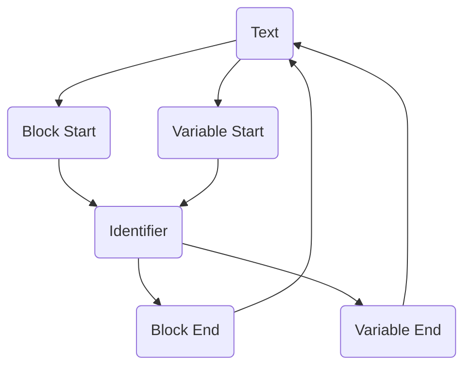
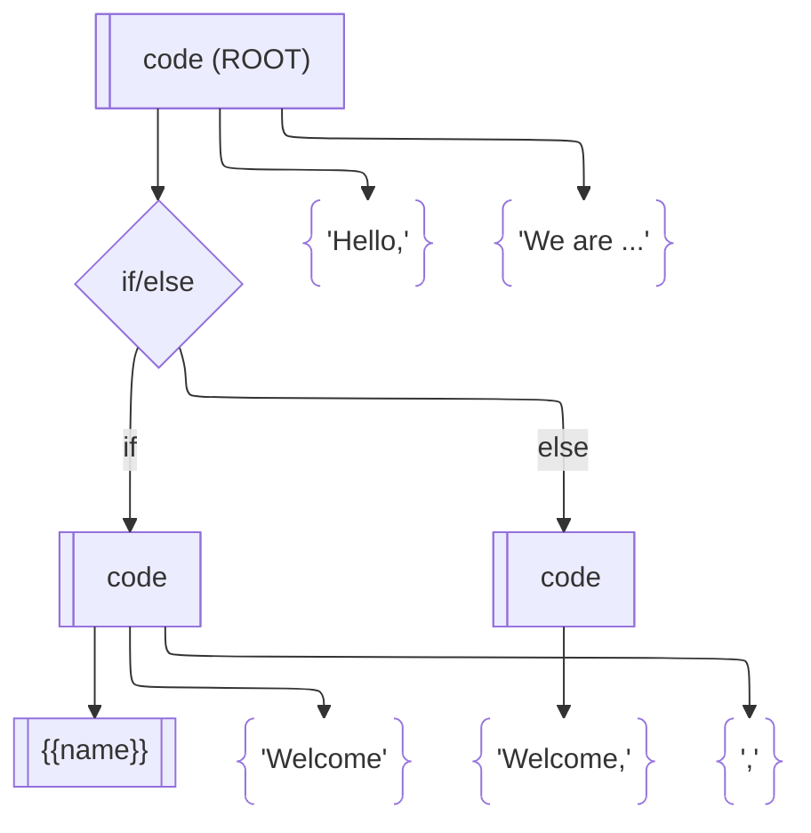

# lexparse

[](https://godoc.org/github.com/ianlewis/lexparse)
[](https://goreportcard.com/report/github.com/ianlewis/lexparse)
[](https://github.com/ianlewis/lexparse/actions/workflows/pre-submit.units.yml)
[](https://codecov.io/gh/ianlewis/lexparse)
[](https://conventionalcommits.org)
[](https://api.securityscorecards.dev/projects/github.com/ianlewis/lexparse)

Experimental lexer/parser library written in Go. Currently under active development.

---

`lexparse` aims to provide a simple API for writing lexers and parsers. The API is based loosely off of Rob Pike's [Lexical Scanning in Go](https://www.youtube.com/watch?v=HxaD_trXwRE) where the lexer's state is itself a function. `lexparse` extends this concept to the parser and also implements state via an interface to allow state to hold data without the need for a closure.

## Installation

You can install the library into your project using `go get`.

```shell
go get github.com/ianlewis/lexparse
```

## Lexing API

The API for `lexparse` is broken up into a lexing API and an optional parsing API. The lexing API handles separating input into tokens.

### Lexer

The `Lexer` is a [lexical analyzer](https://en.wikipedia.org/wiki/Lexical_analysis) operates on a stream of text and outputs tokens which consist of a lexeme (the text) and a type. It is a [finite state machine](https://en.wikipedia.org/wiki/Finite-state_machine) where each state (`LexState`) includes some logic for processing input while in that state. The `Lexer` maintains a cursor to the start of the currently processed token in addition to the underlying reader's position. When the token has been fully processed it can be emitted to a channel for further processing by the `Parser`.

For example, consider the following simple template language.

```jinja
Hello,

Welcome {{ name }},

Welcome,


We are looking forward to your visit.
```

The `Lexer` might produce something like the following tokens:

| Type           | Value                                           |
| -------------- | ----------------------------------------------- |
| Text           | `"Hello,\n"`                                    |
| Block Start    | `{%`                                            |
| Identifier     | `if`                                            |
| Block Start    | `{%`                                            |
| Text           | `"\nWelcome "`                                  |
| Variable Start | `{{`                                            |
| Identifier     | `name`                                          |
| Variable End   | `}}`                                            |
| Text           | `",\n"`                                         |
| Block Start    | ``                                            |
| Text           | `"\nWelcome,\n"`                                |
| Block Start    | ``                                            |
| Text           | `"\n\nWe are looking forward to your visit.\n"` |

For a template language, parsing text is a sort of default state so the state machine might look like the following.


```mermaid
graph TD
%% Nodes
    TEXT("Text")
    BLOCK_START("Block Start")
    BLOCK_END("Block End")
    VAR_START("Variable Start")
    VAR_END("Variable End")
    IDENTIFIER("Identifier")

%% Edge connections
    TEXT-->BLOCK_START-->IDENTIFIER-->BLOCK_END-->TEXT
    TEXT-->VAR_START-->IDENTIFIER-->VAR_END-->TEXT
```

## LexState

Each state is represented by an object implementing the `LexState` interface. It contains only a single `Run` method which handles processing input text while in that state.

```go
// LexState is the state of the current lexing state machine. It defines the logic
// to process the current state and returns the next state.
type LexState interface {
    // Run returns the next state to transition to or an error. If the returned
    // next state is nil or the returned error is io.EOF then the Lexer
    // finishes processing normally.
    Run(context.Context, *Lexer) (LexState, error)
}
```

We will first need to define our token types.

```go
const (
    textType lexparse.LexemeType = iota
    blockStartType
    blockEndType
    varStartType
    varEndType
    identifierType
)
```

If we don't need to carry any data with our state we can implement it with a function that has the same signature as `LexState.Run`. The function can be converted to a `LexState` by the `LexStateFn` function.

In the `lexText` function we peek at the input to determine if we need to emit the current token and change state. Otherwise, we continue advancing over the text. We also handle `io.EOF` in case we have reached the end of the input.

```go
func lexText(_ context.Context, l *lexparse.Lexer) (lexparse.LexState, error) {
    for {
        p, err := l.Peek(2)
        if err != nil {
            if errors.Is(err, io.EOF) {
                // End of input. Emit the text up to this point.
                if l.Width() > 0 { l.Emit(typeText) }
                return nil, nil
            }
            return nil, fmt.Errorf("lexing text: %w", err)
        }
        switch string(p) {
            case "{%": // Block Start
                if l.Width() > 0 { l.Emit(typeText) }
                return lexparse.LexStateFn(lexBlockStart)
            case "{{": // Variable Start
                if l.Width() > 0 { l.Emit(typeText) }
                return lexparse.LexStateFn(lexVarStart)
            default:
        }

        // Advance the input.
        if _, err := l.Advance(1); err != nil {
            return nil, fmt.Errorf("lexing text: %w", err)
        }
    }
}
```

Each state can be implemented this way to complete the `Lexer`'s logic. You can find a full working example in [`template_example_test.go`](./template_example_test.go).

## Parsing API

The parsing API takes tokens from the `Lexer`, processes them, and creates an [abstract syntax tree](https://en.wikipedia.org/wiki/Abstract_syntax_tree) (AST).The parsing API is optional in that the `Lexer` can be used on its own, or with a hand-written parser that is better suited to your use case.

### Parser

Like the `Lexer` in the lexing API, the parsing API's `Parser` is a finite state machine with each state (`ParseState`) implementing some logic for that state. The `Parser` maintains the AST as it's being cerated and a pointer to the current node in the tree. This allows each `ParseState` to operate on the tree in the correct position.

However, one difference from the lexer API is that the parser API utilizes [Go's generics](https://go.dev/doc/tutorial/generics). Nodes in the AST use generics to allow each node to hold custom data.

Using the example template language above, the `Parser` might generate an AST that looks like the following.


```mermaid
flowchart-elk TD
%% Nodes
    ROOT@{ shape: lin-rect, label: "code (ROOT)" }
    CONDITION@{ shape: diamond, label: "if/else" }
    IF@{ shape: lin-rect, label: "code" }
    ELSE@{ shape: lin-rect, label: "code" }
    NAME[["{{name}}"]]
    HELLO@{ shape: braces, label: "'Hello,'" }
    WELCOME@{ shape: braces, label: "'Welcome'", }
    WELCOME_COMMA@{ shape: braces, label: "'Welcome,'", }
    COMMA@{ shape: braces, label: "','"}
    MESSAGE@{ shape: braces, label: "'We are ...'"}

%% Edge connections
    ROOT-->HELLO
    ROOT--->CONDITION
    ROOT--->MESSAGE
    CONDITION--if-->IF
    CONDITION--else-->ELSE
    IF-->WELCOME
    IF-->NAME
    IF-->COMMA
    ELSE-->WELCOME_COMMA;
```

### ParseState

Similar to the lexer API, each parser state is represented by an object implementing the `ParseState` interface. It contains only a single `Run` method which handles processing input tokens while in that state.

```go
// ParseState is the state of the current parsing state machine. It defines the logic
// to process the current state and returns the next state.
type ParseState[V comparable] interface {
    // Run returns the next state to transition to or an error. If the returned
    // next state is nil or the returned error is io.EOF then the Lexer
    // finishes processing normally.
    Run(context.Context, *Parser[V]) (ParseState[V], error)
}
```

We will first define our node types and custom data.

```go
type nodeType int

const (
    // code node's children are various text,if,var nodes in order.
    codeNodeType nodeType = iota

    // text nodes is a leaf node comprised of text.
    textNodeType nodeType

    // if is a binary node whose first child is the 'if' code node and second is the 'else' code node.
    ifNodeType

    // var nodes are variable leaf nodes.
    varNodeType
)

type tmplNode struct {
    typ    nodeType

    // Fields below are populated based on node type.
    varName string
    text   string
}
```
